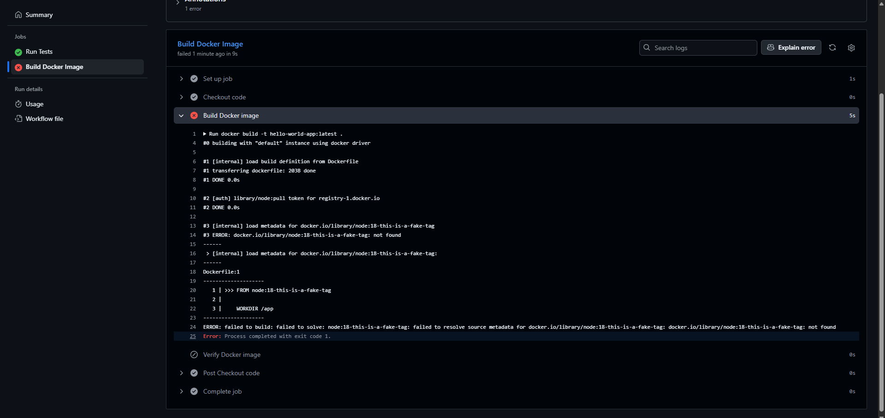
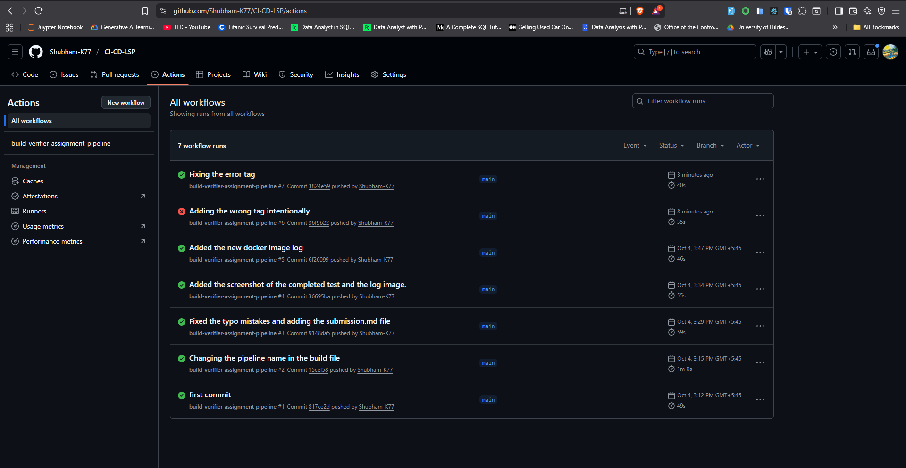

## Assignment 2: The Debugging Detective

---

## **Part A: Analyze the Working Pipeline**

**Jobs:** Independent units of work that can run in parallel or sequentially

- In my workflow: We have 2 jobs (test-job and build-job)
- 1. Test Job:

  - **test-job:** The ID of this job (used internally, like a variable name)
  - **name: Run Tests** Human readable name shown in the GitHub UI. Makes it easy to understand what this job does.
  - **runs-on: ubuntu-latest** Specifies what operating system to use. Runs this job on a virtual machine with the latest Ubuntu Linux. GitHub provides free runners with Ubuntu, macOS, and Windows.
  - **Flow:** i. GitHub creates a fresh Ubuntu VM
    ii. Runs my code on it
    iii. Destroys the VM when done
  - **Steps:** Defines the sequence of actions to be performed. Steps run one after another (sequentially). If any step fails, the entire job fails all-together.
    - **Step-1. Checkout Code:** actions/checkout@v3: Uses a pre-built action (like importing a library). **What it does:** Downloads my repository code to the runner.
    - **Step 2. Set Up Node.js:** actions/setup-node@v3: Uses GitHub's official Node.js setup action. **What it does:** Installs Node.js version 18.
    - **Step 3. Install Dependencies:** Executes a shell command (like typing in terminal). npm install Reads package.json and installs all dependencies.
    - **Step 4. Run Tests:** npm test Runs the "test" script from package.json

- 2. Build Job:

  - **build-job:** The ID of this job (used internally, like a variable name)
  - **name: Build Docker Image** Human readable name shown in the GitHub UI. Makes it easy to understand what this job does.
  - **needs: test-job** Creates a dependency between jobs. Don't start build-job until test-job completes successfully.
  - **Flow:** i. test-job runs first
    ii. Did it pass?
    iii. YES → build-job starts
    iv. NO → build-job is SKIPPED
  - **Steps:**
    - **Step-1. Checkout Code:** Each job runs on a separate, fresh VM. After **test-job** VM is destroyed when it finishes it's execution. **build-job** VM needs the code too, Hence the new VM instance being created for the execution.
    - **Step-2. Build Docker Image:** Reads the Dockerfile. Executes each instruction (FROM, COPY, RUN, etc.) Creates a Docker image named hello-world-app:latest.
    - **Step-3. Verify Docker Image:** Confirms the image was actually built.

- 3. Entire Workflow:
     i. When I push to main branch
     ↓
     ii. GitHub Actions triggered
     ↓
     iii. test-job starts
     ├─ Checkout code
     ├─ Setup Node.js
     ├─ Install dependencies
     └─ Run tests (exit code 0)
     ↓
     iv. build-job starts (because test-job passed)
     ├─ Checkout code
     ├─ Build Docker image
     └─ Verify image
     ↓
     v. Pipeline SUCCESS!

---

## **Part B: The "Break and Fix" Challenge**

- **Break It:** To test the robustness of the CI/CD pipeline, I intentionally introduced an error in the Dockerfile by changing the first line from FROM node:18 to FROM node:18-this-is-a-fake-tag.

- **Push and Observe:** This modification was then pushed as a pull request titled “Adding the wrong tag intentionally”. As expected, the Actions tab displayed a failure in the build-job task, confirming that the GitHub Actions workflow correctly detected the issue. 

- **Analyze:** Upon analyzing the logs, it was evident that the job failed due to the invalid Node.js tag. 

- **Fix It:** After identifying the cause, I fixed the incorrect tag in the Dockerfile and re-ran the workflow. This time, the build executed successfully, indicating that the issue had been resolved. 

- **The following logs show both the failed and successful builds respectively:**
  
  

- **Explanation of the error:** To check the robustness of the CI/CD pipeline, I deliberately introduced an error in the Dockerfile. The first line, which originally read: FROM node:18 to FROM node:18-this-is-a-fake-tag
   
  This change was then pushed as a pull request titled “Adding the wrong tag intentionally.” As expected, the GitHub Actions workflow detected the error and the build-job task failed.
   
  The error occurred because the Docker image tag node:18-this-is-a-fake-tag does not exist in the Node.js Docker repository. When the CI/CD pipeline tried to pull this image, Docker could not find it, causing the build to fail. This demonstrates that the pipeline is correctly validating the configuration and preventing builds with invalid dependencies.

- **Explanation of the fix:** To resolve the issue, I reverted the Dockerfile line back to the valid tag: FROM node:18
   
  After committing and pushing the fix, the workflow re-ran automatically. This time, the build completed successfully, confirming that the pipeline was functioning correctly.

---
