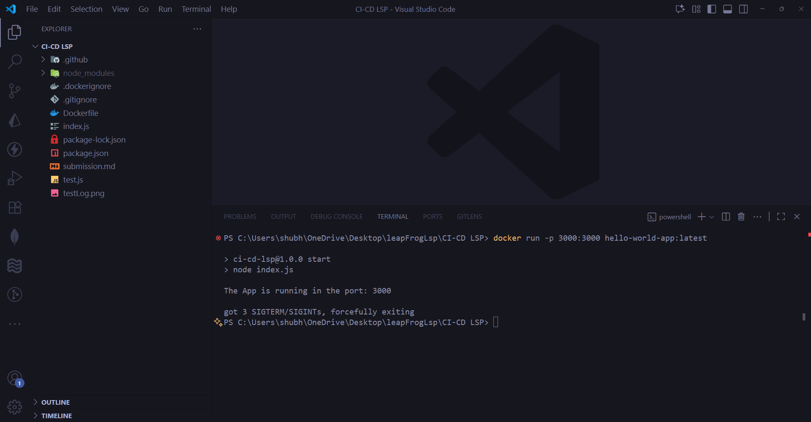
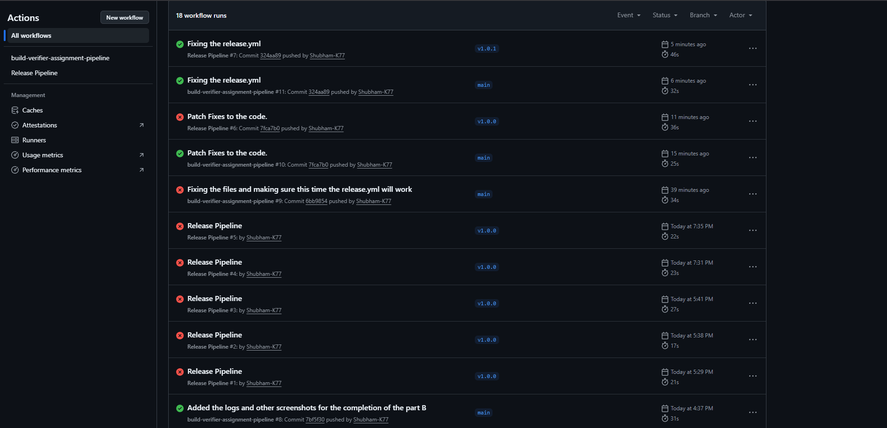

## Assignment 1: The Build Verifier

---

this one was the warm‑up. i made a tiny node app, wrote a dockerfile, and a simple github actions workflow to test and build. learned basics of jobs/steps, caching a bit, and mostly how fast you see mistakes in logs.

- repo link (has dockerfile + workflow): https://github.com/Shubham-K77/ci-cd-lsp
- successful workflow run: https://github.com/Shubham-K77/ci-cd-lsp/actions/runs/18242560239

proof bits i kept:

what went a bit messy: i mixed up some yaml spacing early, also forgot to install deps before tests in one try. tiny stuff, but it taught me to read the action logs and keep steps small. success in the end: pipeline turned green and image built, tests pass both locally and in ci.

---

## Assignment 2: The Debugging Detective

this one i kind of broke things on purpose and then had to clean it up. i changed the docker tag to a fake one, build just died, logs yelling at me. i poked around the steps, learned to read errors better, and saw how jobs stop when one step fails. lesson: start simple, fix the first red thing, don’t overthink.

struggles: wrong image tag, a couple yaml hiccups, chasing why it failed in the docker build stage. learning: use the logs, understand job order, keep steps clear. success: fixed the tag, re-ran, it went green again.

full notes + screenshots live here: [debugging.md](./debugging.md)

---

## Assignment Three: Assignment 3: The Release Architect

so i took the basic app and made a real release pipeline. i tagged the repo like `v1.0.0` and the workflow kicked in. it builds the docker image with multi-stage (first only deps, then runner), scans it with trivy, then pushes to ghcr and finally makes a github release for me. nothing fancy, just works the way i want.

struggles? yeah a few. at first my dockerfile tried to run `npm run build` but i didn’t even have a build script. that blew up the job and i stared at logs for too long. then the security scan kept failing on high issues, so i tuned it to fail only on critical like the assignment said. also messed up the order of build/scan/push once. i kept notes and screenshots here:

if you want the friendly overview with badge and links, i wrote it here: [README.md](./README.md)

---
